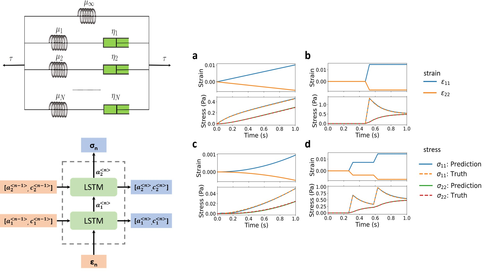

# Recurrent neural networks (RNNs) learn the constitutive law of viscoelasticity
RNN-viscoelasticity model development

# Content
- data: the dataset for RNN-viscoelasticity model development
- src: the source code for model development and construction of one-to-one architecture from the trained model

# How to cite
Chen, Guang. "Recurrent neural networks (RNNs) learn the constitutive law of viscoelasticity." Computational Mechanics 67.3 (2021): 1009-1019. https://doi.org/10.1007/s00466-021-01981-y.
